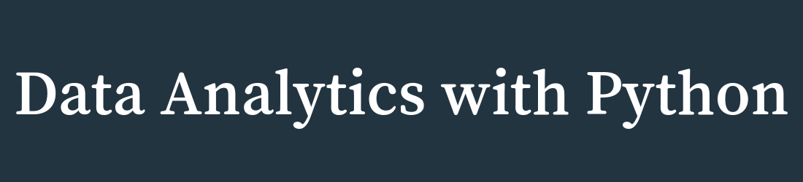

## About

## Table of Contents

1. **Lecture 1**
   - [Notes]()
   - [Assignments]()
   - [Additional Learning]()
   - [Practice]()
     
2. **Lecture 2**
   - [Notes]()
   - [Assignments]()
   - [Additional Learning]()
   - [Practice]()
     
3. **Lecture 3**
   - [Notes]()
   - [Assignments]()
   - [Additional Learning]()
   - [Practice]()
     
4. **Lecture 4**
   - [Notes]()
   - [Assignments]()
   - [Additional Learning]()
   - [Practice]()
     
5. **Lecture 5**
   - [Notes]()
   - [Assignments]()
   - [Additional Learning]()
   - [Practice]()
     
6. **Lecture 6**
   - [Notes]()
   - [Assignments]()
   - [Additional Learning]()
   - [Practice]()
     
7. **Lecture 7**
   - [Notes]()
   - [Assignments]()
   - [Additional Learning]()
   - [Practice]()
     
8. **Lecture 8**
   - [Notes]()
   - [Assignments]()
   - [Additional Learning]()
   - [Practice]()
     
9. **Lecture 9**
   - [Notes]()
   - [Assignments]()
   - [Additional Learning]()
   - [Practice]()
